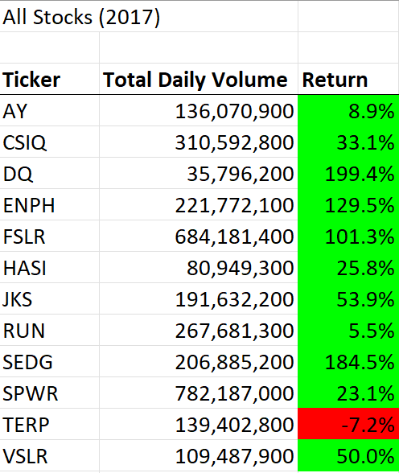
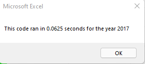

# Stock Analysis

## Project Overview

Create an excel application for client to analyze stock data for 2017 and 2018. Compare the stock performance between years and deliver findings. This application will have the ability to analyze thousands of stocks at reduced execution time. The requested output for the analysis includes stock tickers, total daily volume, and stock results. 

## Results

#### Stock Performance
The 12 stocks compared were more successful in 2017 than 2018. In 2017, 11 stocks were positive in sales with an average of 67% gain. In comparison, 2018 had 10 stocks were negative with an average of 8.5% loss. The top stock performance results were DQ @ 199.4% (2017) and RUN @ 84.0% (2018). The worst performerance results were TERP @ -7.2% (2017) and DQ @ -62.6% (2018). DQ was the most volatile stock compared.

----

### Code

Created tickerIndex and set two zero. Created three output arrays. tickerVolume was set as a long variable due to the larger output.
     '1a) Create a ticker Index
    'tickerIndex is set equal to zero
    tickerIndex = 0   
    
    '1b) Create three output arrays
    Dim tickerVolumes(12) As Long
    Dim tickerStartingPrices(12) As Single
    Dim tickerEndingPrices(12) As Single
    
    
Set i from 0 to 11 to match with tickers. Loop was set to zero for initation of array. For i loop was closed immediately after loop to save execution time. RowCount starts at 2 to avoid header.

    '2a) Create a for loop to initialize the tickerVolumes to zero. 
    For i = 0 To 11
        tickerVolumes(i) = 0
        tickerStartingPrices(i) = 0
        tickerEndingPrices(i) = 0
    Next i
        
    '2b) Loop over all the rows in the spreadsheet.
        For i = 2 To RowCount

If tickerVolume matches a ticker, the volume is added. Included row check for first and last rows to make sure correct volumes being added relative to ticker. Lastly, tickerIndex increases to next ticker if the next rows tickers doesn't match the last (starting to compare a new ticker).
 
     '3a) Increase volume for current ticker
                'If the row matches a ticker then volume increases
            tickerVolumes(tickerIndex) = tickerVolumes(tickerIndex) + Cells(i, 8).Value
        
     '3b) Check if the current row is the first row with the selected tickerIndex.
            If Cells(i - 1, 1).Value <> tickers(tickerIndex) And Cells(i, 1).Value = tickers(tickerIndex) Then

                tickerStartingPrices(tickerIndex) = Cells(i, 6).Value
        
            End If
        
      '3c) check if the current row is the last row with the selected ticker
         'If the next rows ticker doesnt match, increase the tickerIndex.
            If Cells(i + 1, 1).Value <> tickers(tickerIndex) And Cells(i, 1).Value = tickers(tickerIndex) Then

                tickerEndingPrices(tickerIndex) = Cells(i, 6).Value
            
            End If
          '3d Increase the tickerIndex.
            If Cells(i, 1).Value = tickers(tickerIndex) And Cells(i + 1, 1).Value <> tickers(tickerIndex) Then
            tickerIndex = tickerIndex + 1
            
            End If
        Next i

Again, for loop was set from 0 to 11 and closed immediately after to save on execution time. The row always starts on 4 (first row of table) and then adds number of ticker to match values with the correct tickers. Output set to Ticker, Total Daily Volume, and Return (columns 1, 2, and 3).

    '4) Loop through your arrays to output the Ticker, Total Daily Volume, and Return.
        
        For i = 0 To 11
        
        Worksheets("All Stocks Analysis").Activate
        Cells(4 + i, 1).Value = tickers(i)
        Cells(4 + i, 2).Value = tickerVolumes(i)
        Cells(4 + i, 3).Value = tickerEndingPrices(i) / tickerStartingPrices(i) - 1
    
        Next i
----

The execution times from the original code to refactored code is roughly 7 times faster. The use of arrays to loop data together impacted the increase in speed.
##### Execution times Original
* Time taken 2017 .4414 seconds
* Time taken 2018 .4453 seconds
##### Execution times Refactored
* Time taken 2017 .0625 seconds
* Time taken 2018 .0781 seconds

## Summary

### Advantages of Refactoring Code

### Pros and Cons of Refactoring Original Script 

